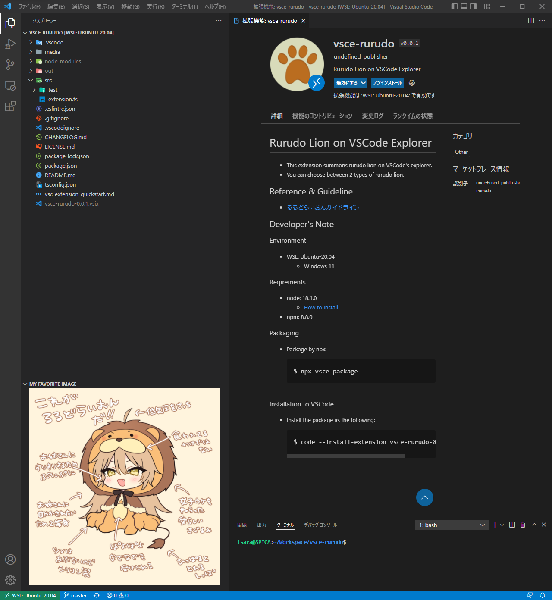

# Rurudo Lion on VSCode Explorer
- This extension summons rurudo lion on VSCode's explorer.
- You can choose between 2 types of rurudo lion.

|Big ver.|Small ver.|
|---|---|
|||

## Reference & Guideline
- [るるどらいおんガイドライン](https://www.fanbox.cc/@rurudot/posts/3802639)

## Developer's Note

### Environment
- WSL: Ubuntu-20.04
  - Windows 11

### Reqirements
- node: 18.1.0
  - [How to Install](https://docs.microsoft.com/ja-jp/windows/dev-environment/javascript/nodejs-on-wsl)
- npm: 8.8.0

### Packaging
- Package by npx:
  ```
  $ npx vsce package
  ```

### Installation to VSCode
- Install the package as the following:
  ```
  $ code --install-extension vsce-rurudo-0.0.1.vsix
  ```
