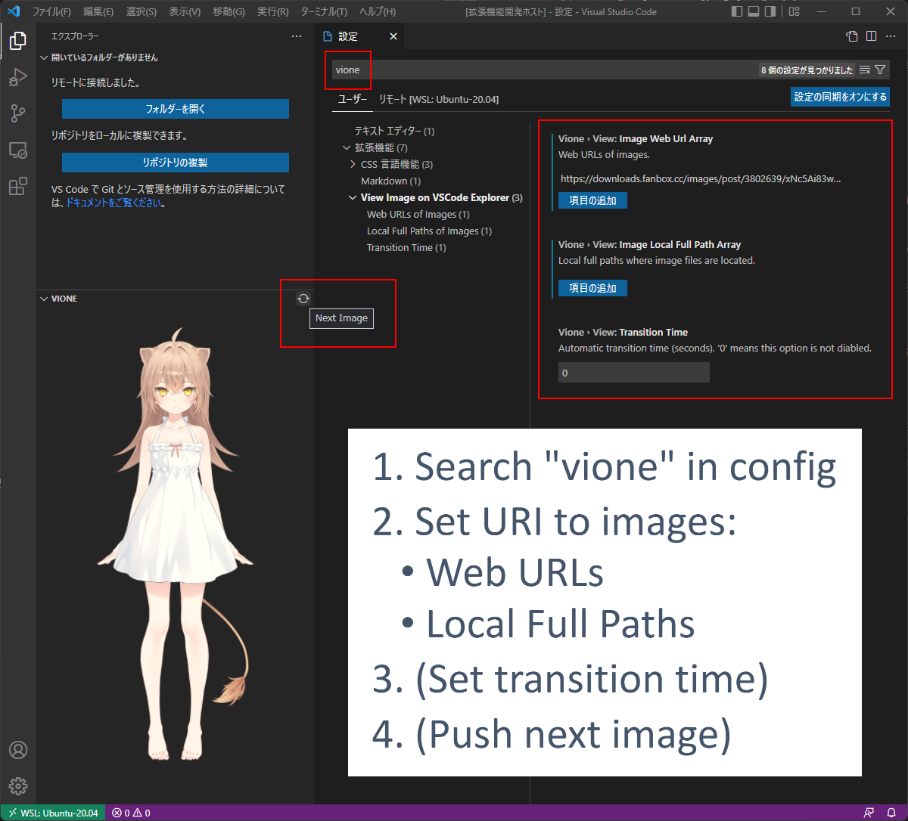

# View Image on VSCode Explorer
- This extension allows you to view images on VSCode's explorer.

## Installation
- [Visual Studio Marketplace](https://marketplace.visualstudio.com/items?itemName=IsaraCarousel.vsce-vione)

## How to Use


- `.gif` image is also OK.


## Reference
- [るるどらいおんガイドライン](https://www.fanbox.cc/@rurudot/posts/3802639)

---

## Developer's Note

### Environment
- WSL: Ubuntu-20.04
  - Windows 11

### Reqirements
- node: 18.1.0
  - [How to Install](https://docs.microsoft.com/ja-jp/windows/dev-environment/javascript/nodejs-on-wsl)
- npm: 8.8.0
- tsc: 3.8.3
  - `$ sudo apt install node-typescript`

### Packaging
- Package by npx:
  ```
  $ ./packaging.sh
  ```

### Installation to VSCode
- Install the package as the following:
  ```
  $ ./install.sh
  ```
